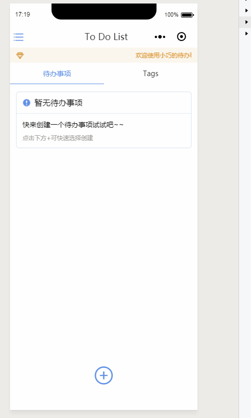
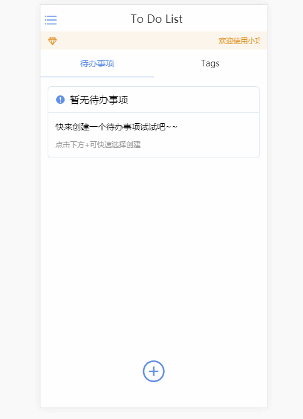

# TODOLIST
> 采用Taro+TaroUI编写的一个精巧的待办事项

> 这里是传送门 [Taro](https://taro.aotu.io/), [TaroUI](https://taro-ui.aotu.io/#/)

### 项目截图

  
小程序端

  
  
H5端

  

### 其他
其实这样的一个小页面不一定非要用上`redux`。但是这个地方我是为了测试`redux`的使用所以大部分的状态全部放到了`redux`里面进行管理，但是使用的时候需要注意一些问题，`Taro`官网文档里面都有注意事项([传送门](https://nervjs.github.io/taro/docs/best-practice.html))。

### 小程序体验

